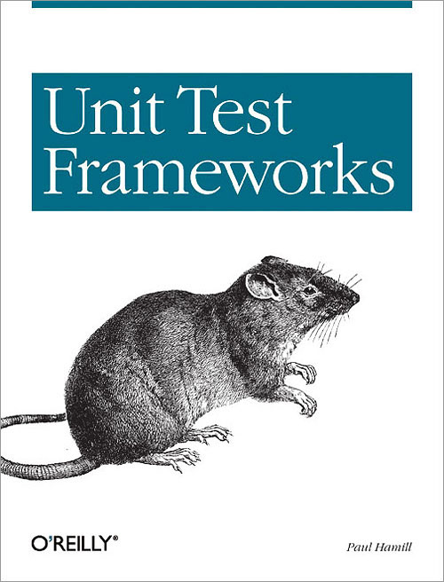

# TDD: The  Hard Parts

😿

<!-- .element style="font-size:15vh;" -->


---

### Hi
<!-- consider just doing this without a slide? -->

- JavaScript @ <span style="font-family: monospace;">Braintree</span>
- Lots of 💚  for 🍜
- Poetry!

Note: if any of those things sound interesting to you, talk to me afterwards.

---

## A hypothetical start

---

You may be familiar with...


---

\#ship-it 🚢🇮🇹

```javascript
class TodoApp () {
  constructor () {
    this.todos = [];
    this.input = document.querySelector('#new-todo');
    this.todoList = document.querySelector('#new-todo');

    this.attachEvents();
    this.render();
  }

  render () { /* ... */ }
  attachEvents () { /* ... */ }
}

let app = new TodoApp();
```

---

😱
<!-- .element style="font-size:15vh;" class="spin" -->

Note: animate this shiznit

---

We know this is a _bad_ idea.

But why? <!-- .element class="fragment" -->

---

> The general adoption of unit testing is one of the most fundamental advances in software development in the last 5 to 7 years.

<a href="http://blog.codinghorror.com/i-pity-the-fool-who-doesnt-write-unit-tests/" class="citation">Jeff Atwood</a>

Note: We've got a _very_ healthy culture of advocating for testing. Most of us here (whether we do it all the time or not) would say that automated testing is a good thing

---

<pre style="font-size: 100%; box-shadow: none;">
┓┏┓┏┓┃
┛┗┛┗┛┃＼○／
┓┏┓┏┓┃  /     No unit
┛┗┛┗┛┃ノ)
┓┏┓┏┓┃         tests
┛┗┛┗┛┃
┓┏┓┏┓┃
┛┗┛┗┛┃
┓┏┓┏┓┃
┃┃┃┃┃┃
┻┻┻┻┻┻
</pre>

<a href="https://twitter.com/davidwalshblog/status/502910175066349568" class="citation">@davidwalsh</a>

---


---

<!-- .slide: data-background="img/hammertime.gif" -->

Note: from http://musichistoryingifs.com/


---


<a href="http://dailyjs.com/2014/12/16/1333-javascript-survey-results/" class="citation">2014 JS Daily Survey</a>

---

> Test-first fundamentalism is like abstinence-only sex ed: An unrealistic, ineffective morality campaign for self-loathing and shaming.

<a href="http://david.heinemeierhansson.com/2014/tdd-is-dead-long-live-testing.html" class="citation">David Heinemeier Hansson</a>

Note: We have a culture that compulsively advocates unit testing (for good reason) but does not necessarily give us the background on the purpose behind coverage. Like a lot of other movements within software development (agile, semantic html, etc) the benefit of adoption can get lost in the noise around standardizing and implementation.
---

## A little history

---


---

<!-- .slide: data-background="img/magnetic-computer-tape.jpg" -->

Note: Kent Beck claims that he was inspired by an early book that encouraged programmers to write a piece of tape with an expectation and then compare the output of their program to that original piece of tape. Regardless, the need for feedback has been recognized by past programmers. Image from Museum Victoria http://museumvictoria.com.au/collections/itemimages/205/679/205679_large.jpg

---


<a href="http://singlepageappbook.com" class="citation">singlepageappbook.com</div>

Note: Credit for image to Mixu's single page app book http://singlepageappbook.com/assets/tdd.png
---


TDD is about:

- Feedback
- Ownership
<!-- .element class="fragment" -->
- Empowerment
<!-- .element class="fragment" -->

Tests are a means to an end
<!-- .element class="fragment" -->

Note: this is a holistic thing. You're supposed to feel _better_ about writing new code and maintaining existing code. No one should hang you out to dry for not having perfect coverage or an immense testing suite if you feel comfortable maintaining your code base (and passing it on to others)

---

TDD should be _guilt free_

Note: 100% coverage does not mean you are a better person or developer. WE MAY WANT TO INCLUDE SOME BDD information here

---

## Roadblocks to TDD

---

😿  Not Enough Time

---

<!-- .slide: data-background="img/fry-money.jpg" data-background-style="opacity:0.7;" -->

😸  Don't quote tests

Note: PMs are rarely going to put "write tests" on a roadmap. Tests are part of a feature, not a feature in themselves. Pad your estimates with time for testing built in. That means you don't have to feel awful if you bang your head against a wall trying to test a feature. Tests aren't extra work, they are _the_ work.

---

😸  Be pragmatic

Note: you don't always need 100% or even 80% coverage. Maximize what sort of things you are testing if you are really on a time crunch. We'll get into this more later.

---

😿  No Culture

Note: it's very difficult to work in a project where there is little buy-in for testing.

---

😸  Create a Test Positive Culture

- Code should be covered by tests whenever possible.
- Tests should clearly describe the feature they cover.
- Someone should be able to help you write better tests.

---

😸  Find a better culture (there are many)


---

😿  Building testing infrastructure is hard



Note: There's a lot of investment up front. I may take a week or two (or more) to figure out and implement a solid testing infrastructure. (would be good if we could have an image to )
---

😸  Get help (from a real person)

Note: IRC; your local meetup; a more knowledable coworker. Someone has solved your problem before. Make sure you use all the available resources (and make yourself available as well!). Being a front-end developer means that you may not _love_ digging around in the terminal configuring things all day. That's totally okay, just find someone who can get you over the hump.

---

😸  Don't roll your own (unless you have to)


Note: If you are manually running your tests/setting up scaffolding you probably shouldn't be
---


These pluggable frameworks will helper you launch browsers, pre-process (and more!)

- 😸 [karma](http://karma-runner.github.io/0.13/index.html)
- 😸 [testem](https://github.com/airportyh/testem)
- 😸 [zuul](https://github.com/defunctzombie/zuul)
- 😸 [intern](https://github.com/defunctzombie/zuul)

<!-- .element class="unstyled-list" -->

---

😸  Invest Up Front

Note: Braintree gives devs every other Friday to work on a technical project. I've used this time to help build some testing infrastructure up. The extra time is _worth_ it to make your everyday better.
---

## Building

---

😿  Front-End Iteration

Note: even with an application as simple as the one we are building, it can be hard to get started if you are used to iterating on the front-end. I often develop "in browser" and that poking around with a layout/interface is hard to test. Getting started can be the hardest part. (A Video here of someone playing around with a browser setting)

---

It's hard to TDD "feel"

```javascript
  it('pops')
```

Note: I often find myself discarding the test driven workflow at the start of a project when I am iterating on a UI. Because we are in "mid-stack" we are often faced with shifting apis or design requirements that force us to be light on our feet.
---

Pairing Pressure

---

😸  The Invaluable Spike


Note: A spike helps us respond changes and iterate without needing to leave the TDD workflow.
---

😸 Outside in: feature first

Note: this is more BDD style (but often the two are conflated)
---

```javascript
// tests/integration/todo-application.test.js
describe('TodoApplication', () => {
  it('allows a user to add todos', () => {
    browser.get('/');

    $('#new-todo')
      .sendKeys('Test')
      .sendKeys(protractor.Key.ENTER);

    var todos = $$('#todo-list li');

    expect(todos.get(0).getText()).toContain('Test');
  });
});
```
---

<video src="clips/failing-integration-test.mov" autoplay playbackRate="1" class="stretch" controls></video>

---

😿  Knowing what to test

---


Note: there are a few different definitions for integration. I'll choose to include "view" tests (albeit ones run headlessly) as "unit" tests and selenium driven tests in the "integration" category. You will probably disagree with me. There are plenty of automated tools out there to help you do this if you need.
---


confidence is made up of _all_ testing layers

Note: coverage is a means of gauging your confidence, but it isn't an exact measure.

---


Note: Things are _always_ different out in the wild. Perfect coverage !== flawless application.

---

😸 Pragmatic coverage: using the most effective layer

Note: some things are more more complex to test at certain layers. Drag and drop operations may not be cost effective to test in a headless browser environment and would be better served at the integration level (through selenium). "Native" features might be better pushed to manual testing if the infrastructure required to test them is too much. It's a constant tradeoff.
---

Component Integration tests: good but not great

```javascript
describe('Headless View Test', () => {
  it('adds a todo', () => {
    let view = new View();
    let input = document.querySelector('#new-todo');

    input.value = 'Add a headless test';
    let event = document.createEvent('Event');
    event.keyCode = 13;
    event.init('keyup');
    input.dispatchEvent(event);

    expect(view.counter).to.eql(1);
  });
});
```

Note: these tests are nice because they area faster than full-on selenium tests, but they aren't as _real_ as your integration tests. You may be relying on

---

😱 not writing tests😱

Note: i'll sometimes just have basic integration tests for a project that let me know if i've broken something or not. Or i'll have simple manual instructions. As long as there is something that allows you to commit with a level of confidence (given the context of your code) that is a good enough. That is, however, not acceptable for handling payments ;) I've actually found it difficult to get out of the testing mindset at times (I really like TDD)

---

😿  Warped Code

---

```javascript
import xhr from 'superagent';
import RSVP from 'rsvp';

function getTodoStatus(id) {
  let deferred = RSVP.defer();

  xhr
    .get(`/api/${id}`)
    .end((err, result) => {
      _handleXhr(deferred, err, result);
    });

  return deferred;
}

function _handleXhr(deferred, err, result) {
  if (err) { return defered.reject('Error'); }

  resolve(result.body);
}
```

---

```javascript
describe('getTodoStatus', () => {
  it('returns a deferred');

  describe('_handleXhr', () => {
    it('rejects if err is defined', () => {
      let testDeferred = {reject: sinon.spy()};
      let error = new Error();
      _handleXhr(error, testDeferred);

      expect(testDeferred.reject).to.have.been.calledWith('Error');
    });
  });
});
```

---

😸 Prefer input control to `_isolation`

```javascript
describe('getTodoStatus', () => {
  let fakeServer = sinon.fakeServer.create();

  it('resolves with an error on connection error', (done) => {
    fakeServer.respondWith('GET', [500, {}, '']);

    getTodoStatus(1)
      .catch((result) => {
        expect(result).to.eql('Error');
        done();
      });
  });
});
```
---

You and your code benefit

```javascript
import xhr from 'superagent';
import RSVP from 'rsvp';

function getTodoStatus(id) {
  return new RSVP.promise((resolve, reject) => {
    xhr
      .get(`/api/${id}`)
      .end((err, result) => {
        if (err) { return reject('Error'); }

        resolve(result.body);
      });
  })
}
```

---

😸 Substitute dependencies

---

```javascript
import externalApi from 'external-api';

class MyService {
  get () {
    return externalApi.request();
  }
}
```
---

Breaking things up for testability 😿

```javascript
import externalApi from 'external-api';

class MyService {
  get () {
    return _externalApiProxy()
  },
  _externalApiProxy () {
    return externalApi.request();
  }
}

```
---

```javascript
import proxyquire from 'proxyquire';

describe('myService', () => {
  it('uses externalApi to fetch todo', () => {
    let fakeExternalApi = {request: sinon.spy()};
    let myService = new proxyQuire('MyService', {
      'external-api' fakeExternalApi
    });

    myService.get();

    expect(fakeExternalApi.request).to.have.been.called;
  });
});
```

---

Dependency Manipulation Tools

- [Proxyquire](https://github.com/thlorenz/proxyquire) <small>CommonJS</small>
- [Rewireify](https://github.com/i-like-robots/rewireify) <small>CommonJS</small>
- [Jest](https://facebook.github.io/jest/) <small>CommonJS</small>
- [Squire.js](https://github.com/iammerrick/Squire.js/) <small>AMD</small>

---

## Maintaining tests


Note: we don't always think of tests like we do production code. The environment is different, but many of the rules apply.
---

Tests are documentation

<pre>
Todos
  #completed()
    returns completed todos
    returns an empty array if there are no results
  #update()
    changes the text of a todo
    adds tags contained in the text of a todo
    updates the edited timestamp of a todo
</pre>

Note: Talk about tests as documentation. show blade's describe output. Say "it's to easy to just check tests off as having been written. I do it all the time :("

---

Tests are destined for copy pasta

Note: make sure your coworkers are copying _good_ tests when possible.

---

😸 Writing a test should be as easy and fun as possible.

Note: Angular has done a great job of making it easy to test things. Regardless of the framework it should be easy to write tests.
---

😸 Obliterate Meaningless tests

```javascript
describe('Todos', () => {
  describe('get', () => {
      // meaningless drivel
      it('has a get method', () => {
        let todos = new Todos();
        expect(todos).to.respondTo('get');
      });

      // this actually covers the method
      it('retrieves todos', () => {
        let todos = new Todos();
        expect(todos.get()).to.eql(1);
      });
  });
});
```

Note: bad tests sneak into the codebase, clutter our understanding, and should be removed as soon as possible. It's too easy to have tests stick around forever.
---

😸 Reduce non-descriptive boilerplate.

```javascript
it('retrieves todos', () => {
  let todos = new Todos();
  todos.configure({admin: true})
  todos.add({
    text: 'test1',
    user: 'Cheryl'
  });

  expect(todos.get(1).text).to.eql('test1');
});

it('deletes todos', () => {
  let todos = new Todos();
  todos.configure({admin: true})
  todos.add({
    text: 'test2',
    user: 'James'
  });

  todos.delete(1);
  expect(todos.get(1)).to.eql(undefined);
});
```
<!-- .element class="side-by-side-code" -->


```javascript
let todos = null;

beforeEach(() => {
  todos = new Todos();
  todos.configure({admin: true});
});

it('retrieves todos', () => {
  todos.add({
    text: 'test1',
    user: 'Cheryl'
  });

  expect(todos.get(1).text).to.eql('test1');
});

it('deletes todos', () => {
  todos.add({
    text: 'test2',
    user: 'James'
  });
// ...
```
<!-- .element class="side-by-side-code fragment" -->

Note: this needs to be a: combination of both useful and descriptive setup + non-useful boilerplate
---

😸  Keep tests CRISP

---

<!-- .slide: data-background="img/kitten-falling-over.gif" -->

## The joys of integration testing

<!--   -->

<!-- (http://www.buzzfeed.com/copyranter/the-best-cat-gif-post-in-the-history-of-cat-gifs?bffb#.jaNlwzaKL)
data-background="http://example.com/image.png" data-background-size="100px" -->

---

`Integration Tests === 😸 😸 😸 `

---

<video src="clips/todo-integration-tests.mov" autoplay playbackRate="5" class="stretch" controls></video>

---

`Integration Tests === 😿 😿 😿 `

---

😿 Flakey tests


---


😸  Invest in infrastructure

---


😸 Be prepared for flakiness

Note: we are using rudimentary retries for our integration tests. This is a boon in my current project where we are downstream from 5 applications in a complex environment. It has taken some of the sting out of CI runs. Props to @walmartlabs for the suggestion in their JSConfg talk.

---

Output from re-runner

Note: we have a re-runner in place for our application. It's rudimentary but very effective
---

😿 Slow Tests

  - Shard
  - Sleep Smart
    avoid `sleep(2000)` when possible, prefer (waitFor) and timeouts

---

Fail as fast and as explicitly as possible.

---

😿 Selenium quirks

```javascript
$('#complete-todo').click();

browser
  .actions()
  .mouseDown()
  .mouseUp()
  .perform();
```

---

```javascript
export function selectItem (elem) {
  elem.click();

  browser
    .actions()
    .mouseDown()
    .mouseUp()
    .perform();
}
```

```
import {selectItem} from './page-helpers';

selectItem($('#complete-todo'))
```

---

Resources

- Test Driven Development By Design
- Building Object Oriented Software, guided by tests
- Is TDD Dead?
- Writing Testable JavaScript

---

## Thanks


* @itsnicktomlin
* github.com/nicktomlin
